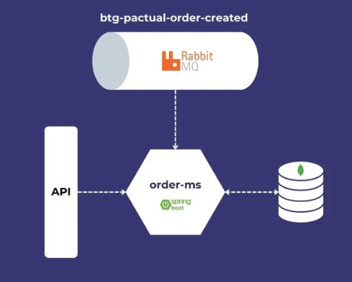

# ORDERMS

## Escopo
Processar pedidos e gerar relatório.

## Atividades



1. Elabore e entregue um plano de trabalho.
   - Crie suas atividades em tasks
   - Estime horas
2. Crie uma aplicação, na tecnologia de sua preferência (JAVA, DOTNET, NODEJS)
3. Modele e implemente uma base de dados (PostgreSQL, MySQL, MongoDB).
4. Crie um micro serviço que consuma dados de uma fila RabbitMQ e grave os dados para conseguir listar as informações:
   - Valor total do pedido
   - Quantidade de Pedidos por Cliente
   - Lista de pedidos realizados por cliente

Exemplo da mensagem que deve ser consumida:

```
   {
       "codigoPedido": 1001,
       "codigoCliente":1,
       "itens": [
           {
               "produto": "lápis",
               "quantidade": 100,
               "preco": 1.10
           },
           {
               "produto": "caderno",
               "quantidade": 10,
               "preco": 1.00
           }
       ]
   }
```


5. Crie uma API REST, em que permita o consultar as seguintes informações:
   - Valor total do pedido
   - Quantidade de Pedidos por Cliente
   - Lista de pedidos realizados por cliente

## Resolução
- Criar um microserviço com Spring Boot
- Consumir uma fila do RabbitMQ
- Comunicar com o banco de dados MongoDB via Docker
- Mapear uma collection do MongoDB dentro do Spring
- Fzer aggregations no MongoDB com Spring
- Efetuar logs com o SLF4J

## Subir o projeto
Antes de executar o projeto é necessário subir o Mongo e RabbitMQ com o comando:

```bash
docker compose up --build
```

Para acessar o RabbitMQ: `http://localhost:15672`. 
Login: guest
Passowrd: guest